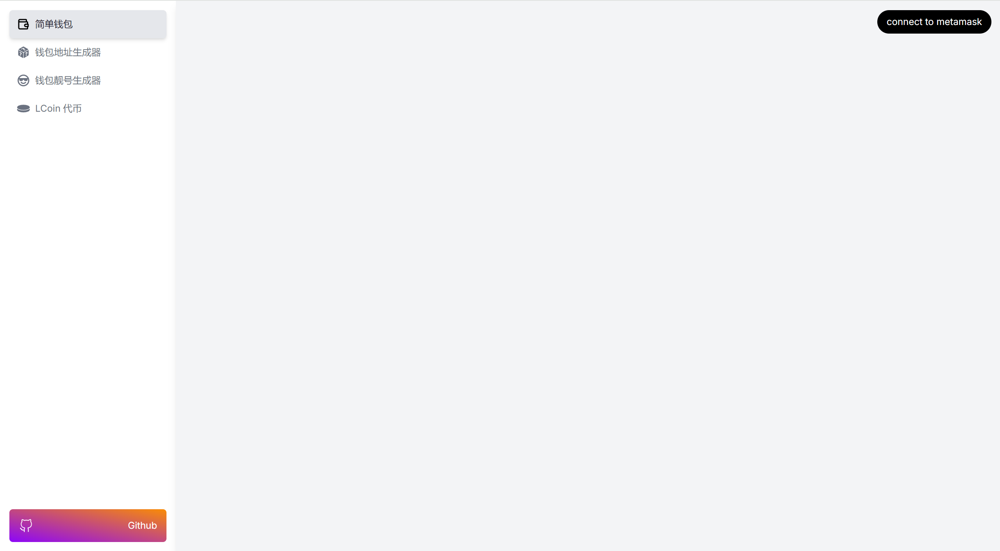
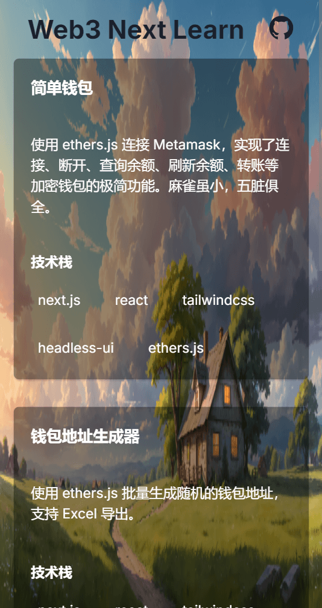
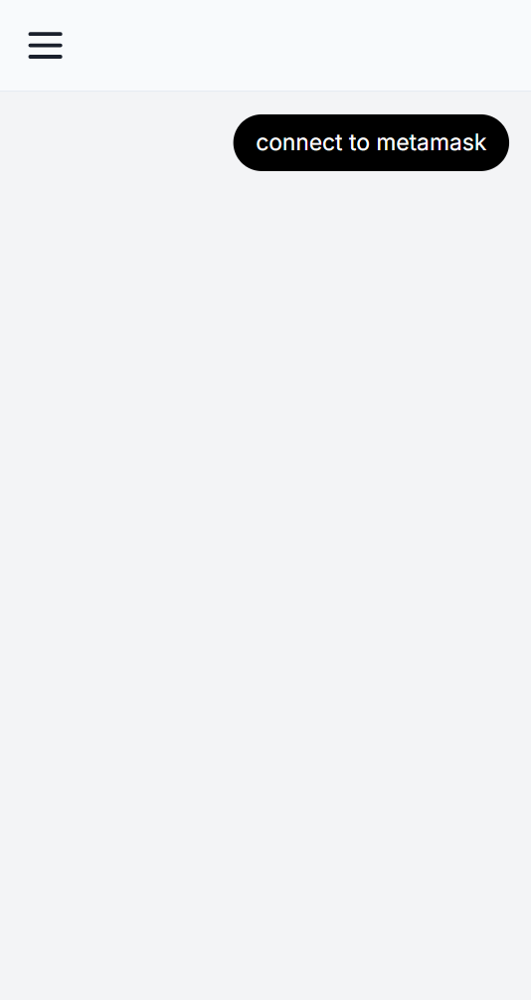

## Web3 next learn app

Please note that this program is for learning exchange purposes only

## Online preview

Preview url(need VPN): [https://web3-next-learn-app.vercel.app](https://web3-next-learn-app.vercel.app)

## Getting started

First, Add configuration information for the `.env` file
Second, run the development server:

```bash
npm i
npm run dev
```

Open [http://localhost:3000](http://localhost:3000) with your browser to see the result.

## Preview images






## More

To learn more about web3, take a look at the following resources:

- [https://github.com/luzhenqian/web3-examples](https://github.com/luzhenqian/web3-examples) - learn more about web3 examples.
